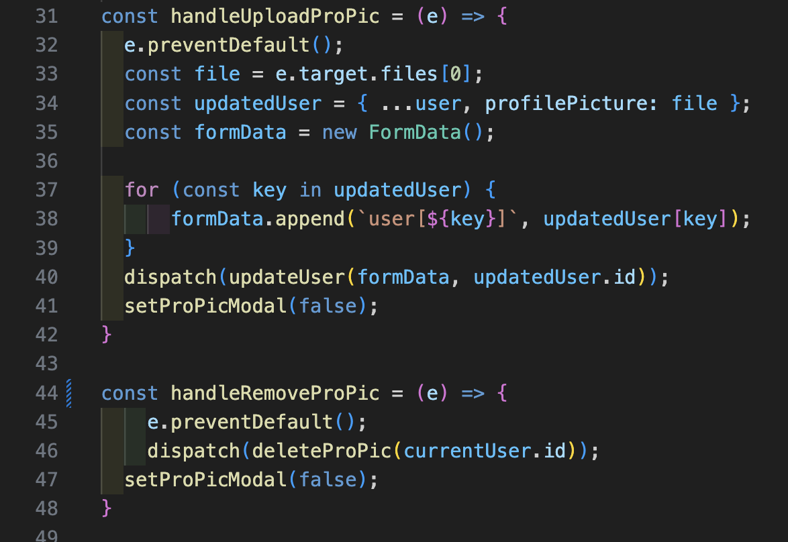
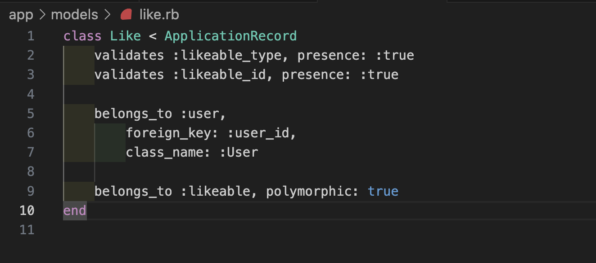
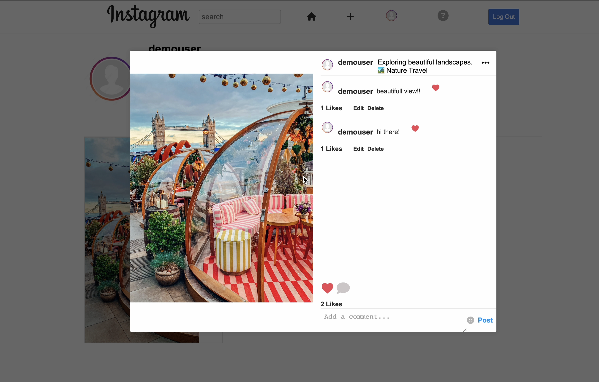
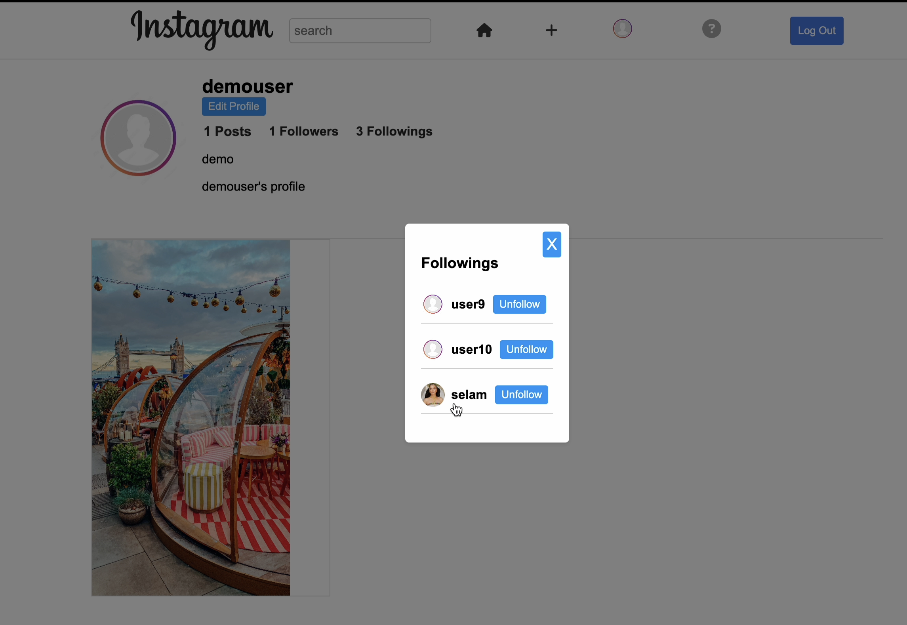
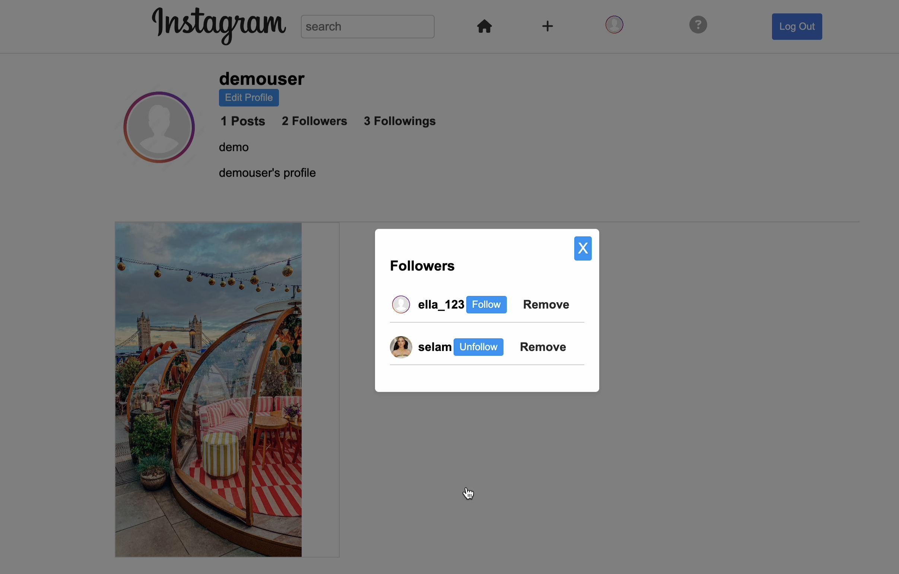
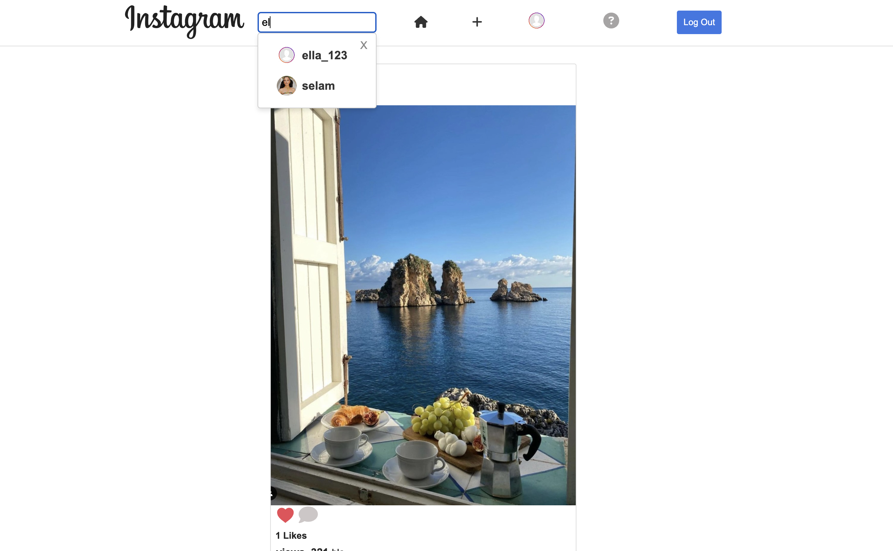

# Insta
Welcome to Insta! This web application replicates the core features of the popular socialmedia platform Instagram, providing users with the ability to create account, share their photos, follow other users, and interact with posts through likes and comments.

## Live 
Visit the app: [Insta](https://insta-hosting.onrender.com)

# Technologies
* JavaScript
* React
* Redux
* Ruby on Rails
* PostgreSQL
* AWS
* HTML
* CSS

# Features
## User Registration and Authentication
- **Secure Sign-Up**: Users can create accounts securely (utilized CSRF Tokens for enhanced security).
- **Authentication**: Ensures that only registered users can access the platform.
- **Demo User**: A demo user account is available for users to try out the platform.

    

## Image Upload and Display and User Feed
- **Create Posts**: Users can create posts with uploaded images, edit them, and delete them.
- **Image Upload**: Users can upload images from their devices to share with their followers.
- **User Feed**: The main feed displays a chronological stream of posts from followed users, keeping users updated on their friends' activities.

## User Profiles
- **Unique Profiles**: Each user has a unique profile where they can upload a profile picture, write a bio, and update their contact information.

   

   

## Likes
- **Like and Unlike**: Users can like and unlike posts and comments to show appreciation and engagement.
  - Utilized a polymorphic association table to handle likes efficiently.
  - This allows likes to be associated with various types of content, such as posts and comments, using a single table and reducing redundancy.

    
   

## Comments
- **Post, Edit, and Delete**: Users can post comments, edit them, and delete them to interact with posts effectively.

## Follow and Unfollow
- **Follow Other Users**: Users can follow other users to receive their posts in their feed.
- **Unfollow Users**: Users can unfollow users at any time to control their feed content.
- **Remove Follower**: Users can also remove followers if needed.

     
  
## Search Functionality
- **Search Users**: Users can search for other users using keywords or names, making users discovery easy.

  
